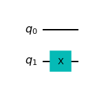

## Testing


```python
import numpy as np

# Importing standard Qiskit libraries
from qiskit import QuantumCircuit, transpile, Aer, IBMQ
from qiskit.tools.jupyter import *
from qiskit.visualization import *
from ibm_quantum_widgets import *
from qiskit.providers.aer import QasmSimulator

# Loading your IBM Quantum account(s)
provider = IBMQ.load_account()
```

    ibmqfactory.load_account:WARNING:2022-11-27 03:45:29,143: Credentials are already in use. The existing account in the session will be replaced.


```python
qc = QuantumCircuit(2)
```


```python
qc.x(1)
qc.draw()
```


    

    


```python

```
